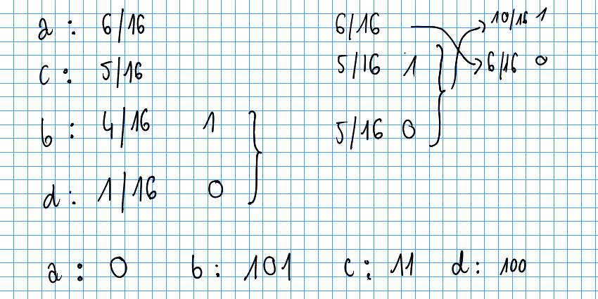
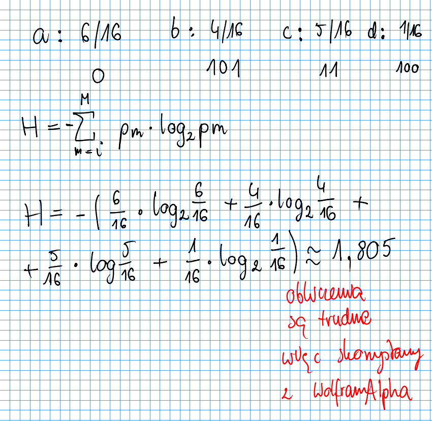
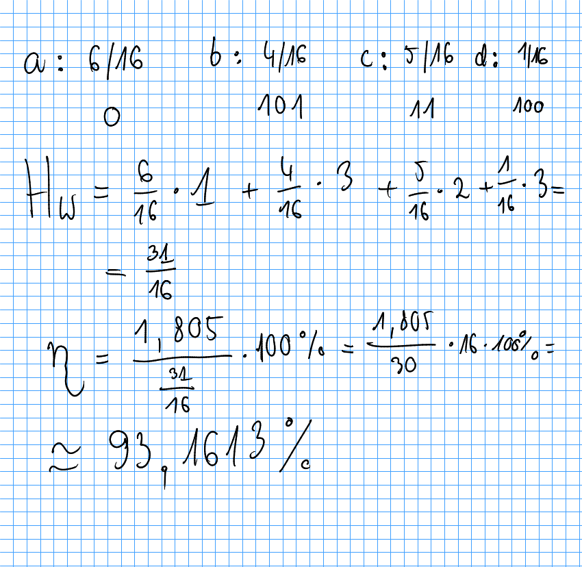

# [WAD, 24.01.19] drzewa Huffmana
---

## Zakoduj poniższe ciągi znaków

1. `abbcaaacccdabbca`
2. `145213211122235412`
3. `zxcvvxzcxvzxcxczvx`

#### policzymy ciąg pierwszy ręcznie, pozostałe w całości za pomocą programu

- **krok 1**: występowanie poszczególnych znaków

```
b: 4/16
d: 1/16
a: 6/16
c: 5/16
```

- **krok 2**: zastosowanie algorytmu

Tworzenie drzewa zaczynamy od "dołu". Dwa znaki o najmniejszej częstotliwości występowania łączymy i sumujemy ich prawdopodobieństwa. Nadajemy im też zera i jedynki. Potem postępujemy podobnie, znowu znajdujemy dwie gałęzie o najmniejszym prawdopodobieństwie wystąpienia i nadajemy im zera oraz jedynki. Czynność powtarzamy do momentu, gdy nie zostanie nam jedyna gałąź. Aby odczytać kody poszczególnych znaków - przechodzimy przez drzewo od góry do dołu.



- **wynik**:
```
a: 0
b: 101
c: 11
d: 100
```

## przedstawienie binarne trzech ciągów znaków
```
Encoding `abbcaaacccdabbca` using Huffman Algorithm.
{'b': "101", 'd': "100", 'a': "0", 'c': "11"}
 0 101 101 11 0 0 0 11 11 11 100 0 101 101 11 0


Encoding `145213211122235412` using Huffman Algorithm.
{'3': "1011", '4': "100", '5': "1010", '1': "0", '2': "11"}
 0 100 1010 11 0 1011 11 0 0 0 11 11 11 1011 1010 100 0 11


Encoding `zxcvvxzcxvzxcxczvx` using Huffman Algorithm.
{'v': "01", 'x': "11", 'z': "00", 'c': "10"}
 00 11 10 01 01 11 00 10 11 01 00 11 10 11 10 00 01 11
```

## Sprawność kodowania powyższych ciągów

Sprawność kodowania wynosi: $\eta = \frac{H}{H_m} 100\%$. Czym są $H$ i $H_m$?

$H$ to *entropia*, którą liczymy z następującego wzoru:
$$ H = - \sum\limits_{m=i}^M p_m log_2 p_m $$

Gdzie $p_m$ to prawdopodobieństwo wystąpienia (dla naszego ciągu `a` ma prawdopodobieństwo równe $\frac{6}{16}$).

$H_w$ to *oczekiwana ilość bitów*, którą liczymy z następującego wzoru:
$$ H_w = \sum\limits_{m=i}^M b_m p_m $$

Gdzie ponownie $p_m$ to prawdopodobieństwo wystąpienia a $b_m$ to długość kodu (dla naszego ciągu `a` ma długość kodu równą $1$).

## Policzmy najpierw ręcznie te wartości dla naszego ciągu `abbcaaacccdabbca`.

- *entropia*:



```
link do Wolframa, który wylicza entropię:
https://www.wolframalpha.com/input/?i=-(6%2F16*log2(6%2F16)+%2B+4%2F16*log2(4%2F16)+%2B+5%2F16*log2(5%2F16)%2B1%2F16*log2(1%2F16))
````

- *oczekiwana liczba bitów* oraz *sprawność kodowania*:



## Pozostałe ciągi policzone maszynowo

Różnice wynikają z ograniczenia pamięci.

```
Encoding `abbcaaacccdabbca` using Huffman Algorithm.
{'b': "101", 'd': "100", 'a': "0", 'c': "11"}
 0 101 101 11 0 0 0 11 11 11 100 0 101 101 11 0
Encoding finished, with efficency 93.16317587495566%


Encoding `145213211122235412` using Huffman Algorithm.
{'3': "1011", '4': "100", '5': "1010", '1': "0", '2': "11"}
 0 100 1010 11 0 1011 11 0 0 0 11 11 11 1011 1010 100 0 11
Encoding finished, with efficency 95.09775004326939%


Encoding `zxcvvxzcxvzxcxczvx` using Huffman Algorithm.
{'v': "01", 'x': "11", 'z': "00", 'c': "10"}
 00 11 10 01 01 11 00 10 11 01 00 11 10 11 10 00 01 11
Encoding finished, with efficency 98.74687506009636%
```
